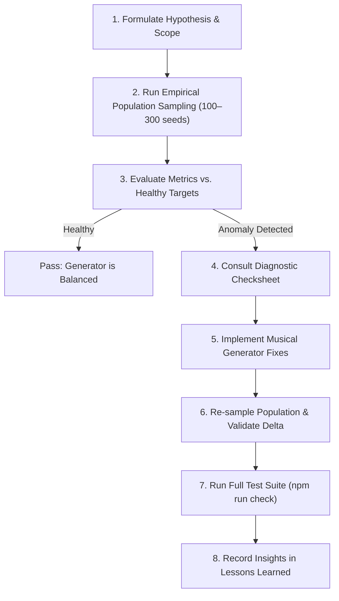

# Exercise Variety Audit & Distribution Balancing

This skill guides agents in empirically auditing, diagnosing, and balancing melodic, rhythmic, and harmonic variety in generated sight-reading and drill exercises.

When procedural generators produce music, small constraints (metric snapping, clamping, gesture tails) often interact to create unintentional formulaic clumping—such as repeating the same cadence sequence in >30% of exercises or freezing on unisons. This skill provides the testing methodology, statistical benchmarks, root-cause diagnostic checks, and lessons learned to prevent and resolve these issues.

---

## When to Use This Skill

- A user reports that exercises "feel monotonous", "always end the same way", or have "too many repeated notes".
- A new musical capability, rhythm cell, or generator feature is added and needs variety calibration.
- Rebalancing generator weights or progressive drill topics to ensure real-world skill transfer.
- Verifying that generation variety is achieved without violating musical theory invariants (e.g. PAC authentic cadences) or deterministic test suites.

---

## Step-by-Step Audit Workflow



### Step 1: Formulate Hypothesis & Scope

Identify the exact user context:
- **Rhythm Style:** Steady (`"steady"`) vs. Mixed (`"mixed"`) vs. Challenge (`"challenge"`).
- **Subdivision:** Quarter notes, eighth notes, half notes.
- **Meter:** 4/4 vs. 3/4 vs. 2/4.
- **Section / Bar:** Cadence bar (last measure) vs. phrase opening vs. continuous melody.
- **Musical Invariants:** In general sight-reading, check both melodic variety and harmonic truth.

### Step 2: Run Empirical Population Sampling

Run an empirical batch script sampling 100 to 300 deterministic seeds using the project's generator:
```sh
npx vitest run .agents/skills/exercise-variety-audit/examples/audit-runner.test.ts
```
*(Or create a temporary test runner if custom parameters are required, remembering to remove temporary test files after validation).*

Extract key metrics:
1. **Pitch Interval Distribution (semitones):** Frequency of `+0` (unisons), `±1` (half steps), `±2` (whole steps), `±3`/`±4` (thirds), and larger leaps.
2. **Cadence Bar Scale Degree Sequences:** Top 10 scale-degree paths in the final measure.
3. **Melodic Contours:** Proportions of downward, upward, flat, and arch contours.
4. **Final Cadence Degrees:** Proportions of ending degrees (1, 3, 5, 2, 6, 7).
5. **Pre-Arrival Motion:** Whether the note immediately preceding cadence resolution moves by step/skip or repeats the arrival pitch.

### Step 3: Evaluate Metrics vs. Healthy Targets

| Metric | Healthy Target | Warning Sign (Needs Fix) |
| :--- | :--- | :--- |
| **Melodic Unisons (`+0` semitones)** | `< 5%` in steady/mixed mode (unless drill is `"rhythm"`) | `> 15%` (generator is freezing on static pitches) |
| **Top Cadence Bar Sequence** | `< 20%` for any single pattern | `> 25%` (formulaic cadence collapse) |
| **Flat Melodic Contours** | `< 25%` | `> 35%` (melodic stagnation) |
| **Upward / Downward Balance** | Natural mix (e.g. 30–50% down, 20–45% up) | `< 10%` for any primary direction |
| **Pre-Cadence Pitch Repetition** | Strictly `0%` | `> 5%` (cadence arrival has no approach motion) |
| **Cadence Final Degree Realization** | Matches cadence plan (PAC = 1; IAC = 3 or 5; Half = 2 or 5) | Clamped to a single degree regardless of plan |

### Step 4: Consult the Root-Cause Diagnostic Checksheet

If any metric fails, inspect the 5 classic generator traps:
1. **Metric Strength Snapping Trap:** Did meter classification mark too many beats as `"strong"` or `"medium"`, causing passing/neighbor tones to be snapped to chord tones? ([Details](./references/diagnostic-checklist.md#1-metric-strength-snapping-trap))
2. **Grammar Length Clamping Trap:** Does a cadence or gesture shape have fewer notes than the measure, causing earlier beats to clamp via `Math.max(0, ...)`? ([Details](./references/diagnostic-checklist.md#2-grammar-length-clamping-trap))
3. **Gesture Tail Stalling Trap:** Do gesture generators (`upperNeighbor`, `enclosure`, etc.) pad extra notes with static base steps instead of completing musical turns? ([Details](./references/diagnostic-checklist.md#3-gesture-tail-stalling-trap))
4. **Post-Arrival Duplication Trap:** Do notes after `arrivalIndex` unconditionally repeat `targetArrivalTone` instead of resolving to harmonic completion tones? ([Details](./references/diagnostic-checklist.md#4-post-arrival-duplication-trap))
5. **Unison Filter Loopholes:** Did unison suppression skip the final note or require `consecutiveUnisons >= 1` before checking pre-cadence notes? ([Details](./references/diagnostic-checklist.md#5-unison-filter-loopholes))

See [Diagnostic Checklist](./references/diagnostic-checklist.md) for detailed code patterns and solutions.

### Step 5: Implement Musical Fixes

- Keep core code pure in `src/core/` (no React, DOM, ABCJS, or `Math.random()`; use injected `Rng`).
- Preserve architectural boundaries and invariant rules from `AGENTS.md`.
- Never modify unrelated components (e.g., left-hand accompaniment unless specifically in scope).

### Step 6: Validate & Re-sample

1. Re-run the sampling script and confirm the metric deltas (e.g., unisons drop from 28% to <4%, top cadence sequence drops below 22%).
2. Run full repository verification:
   ```sh
   npm run check
   ```
3. Remove any temporary analysis scripts before committing.

### Step 7: Record Lessons Learned

Whenever a new failure mode or musical preference is identified, append it to [Lessons Learned](./references/lessons-learned.md) to continuously refine the skill.

---

## References & Tools

- [Diagnostic Checklist](./references/diagnostic-checklist.md): In-depth code patterns for common distribution bugs.
- [Lessons Learned & Case Studies](./references/lessons-learned.md): Historical audits and solutions in this repository.
- [Audit Test Runner Template](./examples/audit-runner.ts): Executable Vitest population sampling script.
